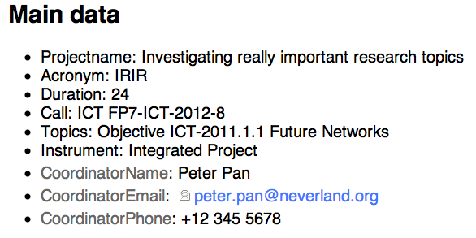
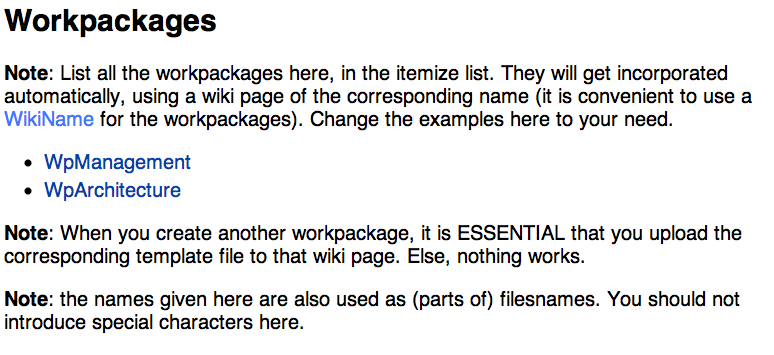
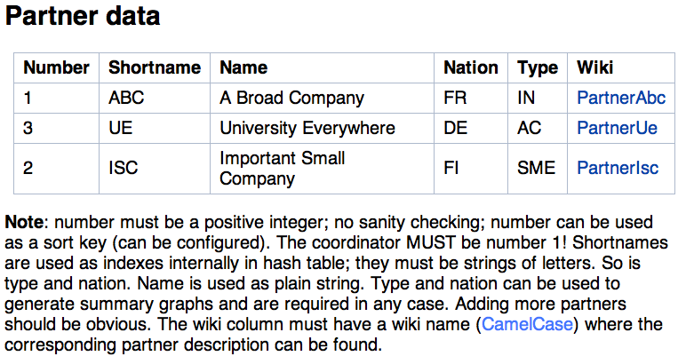
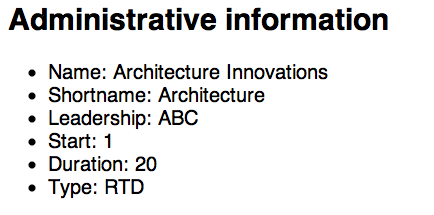
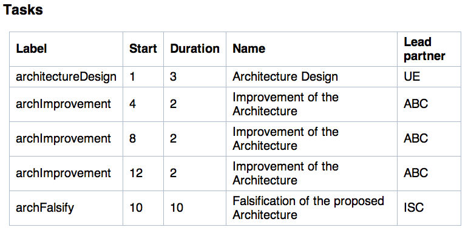
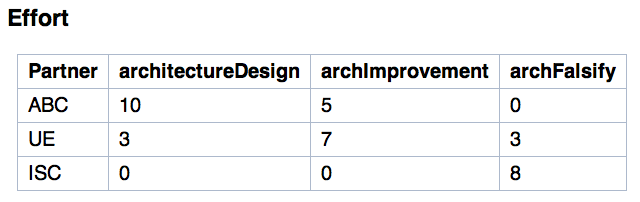

************************************************************
How to use PropGen, what to put on Wiki, building a PDF file
************************************************************

This section describes how to work with the Wiki to enter actual project information. There are three main types of pages: the main project page, a generic text page to hold free text, and the structured work package pages that contain specific information about tasks in a work package, effort distribution, deliverables and milestones, as well as text describing the actual work to be done in a work package.  

=======================
 The main project page
=======================

The main project page (the Wiki page which you configured under projectName in settings.cfg) collects are the general information about the project and it links to further details providing detailed information. Only pages linked from this page are considered in building the proposal text. 

It has four sections: Proposal structure, main data, workpackages, and partner data, described next. It is **important** to keep the structure of this page fixed, else it will not be possible to find relevant information. Sections are recognized by their headings; feel free to move around such sections on the page but do **not** change heading titles or the structure of the individual sections. 

Proposal structure
==================

This section has a bullet list, each just having the name of a Wiki page. Each of these Wiki pages will get downloaded from the Wiki and turned into LaTeX code; each such file is treated as a generic text page (see below for details).  The file name of these LaTeX files will be the same as the Wiki name. The main.tex file can then include these files.

.. figure:: figures/ProposalStructure.png

  Screenshot of the example ProposalStructure section of the main page

The order of the bullets in this list does not matter. The example setup has all the usual sections of a typical EU FP7 proposal and the example main.tex file is already set up to include these files in the appropiate order. 

To add further pages, just add a bullet and put the Wiki name in the line. Add an include command in the right place in main.tex. to get rid of a file, simply remove it from the bullet list and remove the corresponding input command from main.tex. 

There is one special case here, though: if a file includes the phrase
bibtex (in whatever capitalization), it geets turned into a .bib file,
not a .tex file. Usually, a single such line is suitable to point to
the project's bib-file for references, but more are of course
possible. The example setup includes an example with BibtexReferences,
and the main.tex file is setup to use this as a BiBTeX file. 

Main data
=========

The main data section specifies basic data about the project as a whole. 

   Screenshot of main data section 

Similar to the proposal structure section, it is a bullet list with individual items. Here, however, each line is a key/value combination, with the format "key: value". Most lines should be self-explanatory. Duration is the duration of the project in months; do not specify a unit, just the number. 

Workpackages
============

The third part is a list of Wiki pages where a workpackage is described. Same syntax as in the proposal structure section, but the treatment of these pages is different. Unlike above, files here are not just downloaded and converted to LaTeX. Instead, a workpackage page needs to follow a certain structure to specify semantics of a workpackage. Details described below. 

   Screenshot of workpackage list section 

Partner data
============

The partner data has more semantic structure. The important part is a table with four columns: 

   Screenshot of the partner data section

Number 
  Each partner organization needs a number, mostly used for sorting.
  The lead partner MUST be number 1. 

Shortname 
  The acronym to be used for this partner. It shows up in tables, lists,
  etc. 

Name 
  The full, official name of a partner. 

Nation 
  Stanard ISO abbreviation of the partner's legal nation. 

Type 
  Type of partners: academic, research institute, industry, ... 

Wiki 
  The name of the Wiki page where this partner's profile can be found.
  This wiki page is converted to LaTeX and can be included (put into
  the partner directory). 

The order of the rows is irrelevant. 

Budget
======

There is an optional section on budget data. You can put the usual information on person month cost, overhead, cost models, etc. for each partner in this table. (It is split from the partner data table only to keep these two tables at reasonable size.) The input values of this table are used to compute actual cost data, e.g., by multiplying with person month numbers according to workpackage (distinguishing between management and research person months, according to workpackage type). Simply add lines to the Budget table if you need further cost categories. 

The rules for these cost computations are laid out in section BudgetEquations of the settings.cfg file. There, it is easy to add further variables or change computation rules. 

These equations are applied once per partner, in the given order. As an result, all these variables appear in the partnerList list, holding the computed values for each individual partner. As a consequence, these values can be accessed from the LaTeX templates. The BudgetTablePerPartners section is an example how a table with all budget information for all partners. (It is actually less complex than it looks at first sight.) In a similar vain, the pie charts are computed from this input information. 

=====================
 A generic text page
=====================

A generic text page is converted to LaTeX using the wikiParser class
(Section :ref:`sec-wiki-parser`). It can convert a couple of the
standard Wiki markup syntax into LaTeX code. The source code
description provides more details. 

In addition, there is a specific form of markup geared towards the
generation of EU proposals: Whenever there is a pair of level-5 headings of
"Start commission hints" and "End commission hints", the text between
these headings is typeset AFTER the first real heading of the page
(the text is moved accordingly). The example MoinMoin Wiki as well as
the wiki templates contain the corresponding hints given by the
commission in the official template. Whether this text is typeset in
the final PDF can be controlled via the control setting
"showCommissionHints" in settings.cfg. Obviously, before submitting a
proposal, this setting should be set to False. 

Any Wiki page may have, at the beginning, a line: 

## Start of text ##

and at the end, a corresponding line: 

## End of text ##

These lines need not be present, but if so, text before the start or
after the end is ignored. It is still visible on the wiki, though - so
it might be a useful place to put instructions for partners, kept
discussions about the content of a page on the very page itself, etc.
Note that these markers are available on all kinds of pages, also on
the main page and the workpackage pages. 

====================
 A workpackage page
====================

A workpackage page is by far the most complex page, it also has a
rather rigid structure. It consists of four sections, one for the
workpackage's overview description, one for the task descriptions, one
for adminstrative information about the WP as such, and one last
section for adminstrative information on task level. 

A level-1 heading can give the name of the WP; it is not analyzed. 

Work package description
========================

There must be a *level-2 heading* "Objectives". All the text after this
headline, up to the following level-2 heading, it used to typeset the
objectives of a work package.

Then, another *level-2 heading* "WP Description" is needed. Text after
this heading, up to the next level-2 heading, is used to typeset a
description of the WP in the WP forms. 

Tasks descriptions
==================

After that, the tasks inside a work package are described. The
assumption is that a workpackage consists of a reasonable number of
tasks (even only one, if so desired); it is not possible to do without
tasks and only use workpackages. (Not without considerably reworking a
lot of the templates, at least.) This part is started by a *level-2
heading* "Tasks". 

Inside this section, there can be any number of *level-3 headings*,
starting with "Task Description: ", and then the **symbolic label** of
each task: Each task is assigned a label, typically a short word or
phrase (no spaces!) via which information about this task at various
places in this page can be cross-linked. It really makes *no sense at
all* to use labels of the forme, e.g., t2.2 to indicate the second
deliverable in the second task in workpackage two. The entire point
here is have things numbered automatically; using such numbers as
names really defeats the purpose and makes resorting of such entities
(workpackage, tasks, deliverables, milestones) totally confusing. 

Then, there should be, per task, *two level-4 headings* "Objectives" and
"Description of work". The purpose is similar to the WP descriptions,
but they are specifically linked to the particular task. 

Adminstrative information
=========================

The fourth *level-2 heading* is "Adminstrative information". It is
follwed by the formal information about the workpackage. It is
formatted as a bullet list with key/value pairs to provide
information about the workpackage. 

   A bullet list of key/value pairs to provide adminstrative information
   about the workpackage. 

The keys are as follows: 

Name 
  Full name of the workpackage, as shown in tables and titles. 

Shortname 
  Abbreviatiation, used in spaced-limited situations. 

Leadership
  Shortname of the partner organization which leads this workpackage. 

Start 
  Month on which the workpackage starts (on the first day of this
  month); only put the number there, no "M1" or similar. 

Duration
  Number of months the WP lasts. A WP starting in month 5 and last for 2
  months, for example, will start on the first day of the fifth month of
  the project and ends on the last day of the *sixth* month. 

Type 
  Type designation of the WP according to the EU commission
  classification (e.g., RTD: Research and Development, MGMT: Management,
  DEMO: Demonstration). 

Adminstrative information about Tasks
=====================================

The *level-3 heading* "Tasks" (note the different levels for the "Tasks"
headlines!) announces a table, immediately after the Tasks heading. It specifies the following information
in columns: 

   A table listing all the tasks for the particular workpackage. 

Label 
  The symbolic label of the task (the same as used above) 

Start 
  Month of the start of the task. It is assumed to start on the first
  day of the month. 

Duration 
  How long does the task last, in months? For example, a task with Start
  month 1 and Duration 1 month starts on the very first day of the
  project and ends at the end of the first month. 

Name 
  The full name of the task, e.g., used in tables and Gantt charts 

Lead partner 
  Shortname of the partner leading the particular task. 

In general, there is a single row per task. A generalization is a task
that consists of multiple *phases*: It is the task, but is interrupted
and resumed. This can be realized by using one row per phase and using
the *same* task Label in each row. In the second, third, ... row of a
task, only the Start and Duration fields are considered. (It is
currently not possible to specify different names or task leaders for
different phases of a task; these should be treated as separate
tasks!) Such a multi-phase task shows up in the Gantt charts; see the
example of the "Improvment of the Architecture" task.

In this as in all following tables, the first row *MUST* be present
and have the right labels. The labels are used to find out which
column contains which information; missing labels and incorrectly
formatted labels will result in errors. 

Task efforts
============
 
Next, there is a *level-3* heading Effort. It is also followed by
table with the following structure. The first colum - Partner -
contains partner shortnames for partners active in this task. The
following columns have one column per task in this workpackage
(multiple phases are not mentioned separately). 

   Table to specify effort of partners in each task

Each row shows the participation of a partner in the corresponding
tasks. Put person months in a field. No floating point numbers can be
used, only integer numbers of months. 

Partners not participating in a WP at all need not be mentioned. 

Milestones
==========

The *level-3 heading* Milestones announces the milestone table for the
workpackage. Its structure follows the guidelines of the EU proposals.
Specify the following columns: 

Label 
  A symbolic label for the milestone, used to refer to it. 

Month due 
  When must the milestone be achieved? Just the number of the month,
  no "M" or similar. 

Title 
  A full name for the milestone. 

Contributors
  A comma-separated list of partner shortname, showing which partners
  will make contributions to this milestone. In case you want to
  specify a lead partner for a milestone (and similarly for a
  deliverable, see below), simply set it in boldface (using the Wiki's
  specifc markup syntax). 

Description 
  A brief description text. (Leave empty if not desired.) It is
  (typically) typeset in the milestone list per workpackage. 

Producing task(s) 
  Which tasks contribute to this milestone? Put a comma-separated list
  of *task labels* here. Task labels can also come from different
  workpackages; not restricted to the current one. Producing tasks can
  be marked as boldface (similar to contributors); however, this 

Verification means 
  Explain how the project will verify that it has achieved the
  milestone. (Required by standard commission template.) 

Obviously, one row per milestone. 

.. figure:: figures/MilestoneTable.png 

   Table specifying milestones 

Deliverables
============

Finally, the last *level-3 heading* Deliverables announces the table
listing all the deliverables of this workpackage. It has a similar
structure to the milestone table. The only difference is that
"Verification means" is replaced by "Nature" (report, demonstration,
software, ... -checkcommissiontemplate) and "Dissemination"
(restricted RE, public PU, ... - check commission template for details). 

.. figure:: figures/DeliverableTable.png 

   Table specifying deliverables

Generate LaTeX labels
=====================

Based on workpackages, tasks, deliverables, milestones, LaTeX labels are generated as follows (see main.tex for details, it is actually a labitem): 

- For each major section, there is a label in standard LaTeX fashion (see main.tex for details) 

- For each automatically generated partner section, there is a label partner:PARTNERLABEL

- For each workpackage, there is a label wp:Shortname. (Note that this
  is a bit of a hack; it looks to work realiably so far, but that
  might warrant some watching. Implemented in main.tex and the Wp
  template by means of the \WpCounter.) 

- For each task, there is a label task:LABEL 

- For each deliverable, there is a label del:LABEL 

- For each milestone, there is a label ms:LABEL 

- For figures that are generated via the LaTeX templates there are typical labels defined (see templates/latexTemplates.cfg for details). 

- Similarly, the automatically generated tables have suitable labels. Again, typically done via the template scheme; look there for details. 

To each of these labels, you can refer in the text. E.g., suppose you have a task with the label architecture and which turns out to be, e.g., task 3 in workpackage 1, you can write \ref{task:architecture} and that would turn into T\,1.3. (so, ideally, you should write: Task~\ref{task:architecture})

Budget information
==================

There is some rudimentary support for showing budget information. For
this, an excel file has to be put somewhere in the propgen tree, the
path has to be added to settings.cfg file, and the relevant line
ranges have to be specified therein. See the included budget.xls file
(TODO: provide example!). 

This information is currently only used to generate pie charts for
budget distribution. See the corresponding section of
latexTemplates.cfg. It is, however, fairly easy to extend that, e.g.,
to generate a table with such information. 

TODO: make it possible to upload the excel file via Wiki; exploit
information therein better; or directly get this information from wiki
page? 

========================
 Recognized Wiki markup
========================

Only a limited set of Wiki markup syntax is actually recognized and
translated into LaTeX commands. The following list summarizes the
recognized features (see Section :ref:`sec-wiki-parser` for details): 

- Headings are recognized. A level 1 heading is turned into a section,
  level 2 headings become subsections, etc. 
  
- Bullet lists and enumeration lists are recognized and turned into
  itemize and enumerate environments. More precisely, compactitem and
  compactenum environments are used for compacter layouting. 
  
- There is some support for figure inclusion. The basic idea is to
  recognize a figure tag of wiki-specific syntax and turn this into
  the proper LaTeX commands for inclusion. Necessary keys for the
  proper LaTeX markup can be given as keys; details of the syntax are
  highly specific for the Wiki in use (see below). The  following
  keys are recognized:

    file

       Its value is assumed to give the filename of a PDF file in the
       latex/figure directory.  

    label

       Value will become the label in the LaTeX figure environment, for
       cross-referencing. The value will be prefixed by "fig:" to
       delinate it as a figure. 

    caption 

       The caption text to be used in the figure environment 

    latexwidth

       The value is used to scale the figure proportionally to
       textwidth. It should be a value between 0 and 1. The default, if
       this key is not present, is to scale the figure to 0.8 of
       textwidth. 

  The concrete markup looks as follow for the supported Wiki types: 

    twiki 
    
       A fairly simple style as follows works:: 

           

    moinmoin   
      
      Slightly more complex syntax:: 
 
        {{attachment:duckie.png|&postion=htbp,&caption=bla bla and some more text for the caption,&label=fig:duckie,&latexwidth=0.8}}

      It is also acceptable to use the "alternate text" in between,
      which in turns allows to use widht and height markers for the
      moinmoin display in the
      last argument, along with the latex markup: 

        {{attachment:duckie.png|some text describing the figure|width=600,height=400,&postion=htbp,&caption=bla bla and some more text for the caption,&label=fig:duckie,&latexwidth=0.8}}

      and the width and height values will be used to set the figure size
      in the browser.  

      Note the need to put in the ampersands before each key; that
      is a moinmoin peculiarity and is used to mark each label as a
      label for propgen to look at. 

 
- Tables are turned into tabular commands. Columns are equally wide,
  spaced to 80% of the textwidth. To fine-tune the looks of these
  columns, you can specify the column layout: Write e.g. 
  
     ## TABULAR: c|p{0.2\textwidth}|r # 
  
  on a separate line, immediately before the actual table in the wiki
  markup. Anything between TABULAR: and the closing # will be turned
  into the argument of the tabular environment in the LaTeX markup. No
  table environment is generated, if you want that, you can simply
  enclose the Wiki table with the corresponding LaTeX commands, they are
  passed through unhindered. 

  Alternatively, for long tables that need to be split over multiple
  pages, you can also use: 

     ## XTABULAR: c|p{0.2\textwidth}|r # 

  This will generate an xtabular (from the xtab package) instead of a
  tabular environment. The necessary topcaption, tablehead
  etc. commands have to be inserted before the actual table. 

  It can also be convenient to add a {\small before, and a } after the
  actual table. 

- Boldface markup is recognized and turned into \textbf

- Italics markup as well and turned into \emph 

- Anything enclosed in <DEL> ... </DEL> is ignored. Useful to remove
  some text from final production which you still might want to keep
  on the Wiki nonetheless. 

=========================
 Recognized LaTeX markup
=========================

Some attempts are made to maintain special characters. In particular: 

- Some effort is made to deal with ampersand characters &. However,
  they are hard to do since they serve as separators in plain LaTeX,
  and since entering plain LaTeX code should be possible (e.g., for
  complicated tables), they cannot simply all be escaped. The
  current compromises is a follows: 

  - Ampersands that are *followed* (!) by white space are escaped,
    e.g., turned into \& and are typeset thus by LaTeX as an
    ampersand mark. 

  - Ampersands with a preceding backslash - i.e., \& - are also turned
    into correct LaTeX markup and typset as ampersands in the
    resulting text. 

  - Ampersands without spaces around them  (and without preceding backslash)
    are passed through unmodified, unescaped. 

  The upshoot is this: 

  - Users have to be told (and this often causes confusion) that for
    abbreviations like R&D (when no space is desired), they have to
    enter R\&D! This often fails when users are not familiar with
    LaTeX. 

  - Consequence: whenever you use & for wiki markup purposes, they
    MUST NOT be followed by a whitespace. Typical example is the use
    of & in the inclusion of figures in the moinmoin wiki syntax. 

    Put the other way around: No spaces around ampersands in figure
    commands!

  - If you need an ampersand as LaTeX's control character, then you
    must not use space around it. If space is absolutely necessary
    while at the same time using ampersand as control character (not
    that I can of a situation where that would be the case), you could
    use "bla {}&{} bla".

- Line breaks specified by   turn into newline commands 

- Commands of the form: #TODO: some text # are turned into fxwarning
  commands of the fixme package (and appear in warnings.tex) 

- Some attempts are made to provide correct left and right quotation
  marks; guessing is based on spaces before or after a quotation mark ". 

- Pure hash marks # are protected by turning them into \\#. 

- Pairs of \begin{verbatim} and \end{verbatim} are recognized, and whatever is between them is NOT treated for special characters, etc. However, with some limitations: 

  - There MUST be some text before the first \begin{verbatim}. Else, translation will fail. 

  - Nesting of verbatim environments is not supported and will generated completely wrong LaTeX code (which would likely not even compile). 

=====================
 Building a PDF file
=====================

When everything is setup correctly, doing an actual build is trivial:
On a command line, go into the main project directory and type make! 

In case you are using the included Moinmoin wiki, you have a more
direct option as well: This wiki has a preconfigured option
"CreatePDF". Invoking this action triggers the makefile-based build
process and an updated version of the final PDF file is attached to
the main project Wiki page (along with a file logfile.txt that
contains standard output and standard error of the build process). The
example Wiki page TestProject has links to the corresponding
attachments at the very top for easy access. (Change the attachment
link to TestProject.pdf if you rename the main page.) 

========================
 Etherpad-lite  support
========================

The Moinmoin wiki included in the standard distribution can interwork
with an Etherpad-lite installation. The idea is fairly simple: There
are two actions PushToEtherpad and PullFromEtherpad in the Wiki. 

Invoking the PushToEtherpad action creates a pad in a corresponding
Etherpad instance and puts a warning text on the Wiki page, stating
that this page is currently edited on an Etherpad. The warning text
also contains a link to the particular Etherpad pad (usually, when the
warning text is shown, it makes little sense to edit this page, as
changes are likely to be overwritten).  If a pad of the corresponding
name already exists, a new version is created; hence, successive edits
can be tracked. 

Once the Etherpad editing is done, invoke the PullFromEtherpad action
on the Wiki. This copies the current state of the corresponding pad
back from the Etherpad into the wiki, creating a new version of the
wiki page. Note that only the PURE TEXT VERSION of the Etherpad is
considered; no Etherpad-specific markup is taken into account. The
text version MUST be valid Wiki syntax; there are no checks of any
kind. 

The rationale for this integration is to support Wiki editing by an
interactive editing tool, e.g., during a phone conference. 

There are a few configuration options for the IP and port number and
API key file in settings.cfg. Also, you can choose whether the Pads
should have plain names corresponding directly to the wiki name, or
whether some obfuscating characters should be added to provide at
least a little bit of protection since Etherpad lite currently has no
easy way of doing password authentication. 
