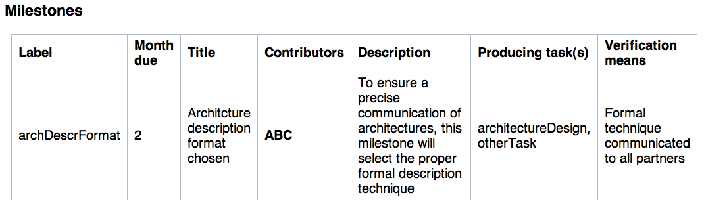

************************************************************
How to use PropGen, what to put on Wiki, building a PDF file
************************************************************

This section describes how to work with the Wiki to enter actual project information. There are three main types of pages: the main project page, a generic text page to hold free text, and the structured work package pages that contain specific information about tasks in a work package, effort distribution, deliverables and milestones, as well as text describing the actual work to be done in a work package.  

=======================
 The main project page
=======================

The main project page (the Wiki page which you configured under projectName in settings.cfg) collects are the general information about the project and it links to further details providing detailed information. Only pages linked from this page are considered in building the proposal text. 

It has four sections: Proposal structure, main data, workpackages, and partner data, described next. It is **important** to keep the structure of this page fixed, else it will not be possible to find relevant information. Sections are recognized by their headings; feel free to move around such sections on the page but do **not** change heading titles or the structure of the individual sections. 

Proposal structure
==================

This section has a bullet list, each just having the name of a Wiki page. Each of these Wiki pages will get downloaded from the Wiki and turned into LaTeX code; each such file is treated as a generic text page (see below for details).  The file name of these LaTeX files will be the same as the Wiki name. The main.tex file can then include these files.

.. figure:: figures/ProposalStructure.png

  Screenshot of the example ProposalStructure section of the main page

The order of the bullets in this list does not matter. The example setup has all the usual sections of a typical EU FP7 proposal and the example main.tex file is already set up to include these files in the appropiate order. 

To add further pages, just add a bullet and put the Wiki name in the line. Add an include command in the right place in main.tex. to get rid of a file, simply remove it from the bullet list and remove the corresponding input command from main.tex. 

There is one special case here, though: if a file includes the phrase
bibtex (in whatever capitalization), it geets turned into a .bib file,
not a .tex file. Usually, a single such line is suitable to point to
the project's bib-file for references, but more are of course
possible. The example setup includes an example with BibtexReferences,
and the main.tex file is setup to use this as a BiBTeX file. 

Main data
=========

The main data section specifies basic data about the project as a whole. 

.. figure:: figures/MainData.png 
   :scale: 50 % 

   Screenshot of main data section 

Similar to the proposal structure section, it is a bullet list with individual items. Here, however, each line is a key/value combination, with the format "key: value". Most lines should be self-explanatory. Duration is the duration of the project in months; do not specify a unit, just the number. 

Workpackages
============

The third part is a list of Wiki pages where a workpackage is described. Same syntax as in the proposal structure section, but the treatment of these pages is different. Unlike above, files here are not just downloaded and converted to LaTeX. Instead, a workpackage page needs to follow a certain structure to specify semantics of a workpackage. Details described below. 

.. figure:: figures/WorkpackagesList.png 
   :scale: 50 % 

   Screenshot of workpackage list section 

Partner data
============

The partner data has more semantic structure. The important part is a table with four columns: 

   Screenshot of the partner data section

Number 
  Each partner organization needs a number, mostly used for sorting.
  The lead partner MUST be number 1. 

Shortname 
  The acronym to be used for this partner. It shows up in tables, lists,
  etc. 

Name 
  The full, official name of a partner. 

Nation 
  Stanard ISO abbreviation of the partner's legal nation. 

Type 
  Type of partners: academic, research institute, industry, ... 

Wiki 
  The name of the Wiki page where this partner's profile can be found.
  This wiki page is converted to LaTeX and can be included (put into
  the partner directory). 

The order of the rows is irrelevant. 

=====================
 A generic text page
=====================

A generic text page is converted to LaTeX using the wikiParser class
(Section :ref:`sec-wiki-parser`). It can convert a couple of the
standard Wiki markup syntax into LaTeX code. The source code
description provides more details. 

In addition, there is a specific form of markup geared towards the
generation of EU proposals: Whenever there is a pair of level-5 headings of
"Start commission hints" and "End commission hints", the text between
these headings is typeset AFTER the first real heading of the page
(the text is moved accordingly). The example MoinMoin Wiki as well as
the wiki templates contain the corresponding hints given by the
commission in the official template. Whether this text is typeset in
the final PDF can be controlled via the control setting
"showCommissionHints" in settings.cfg. Obviously, before submitting a
proposal, this setting should be set to False. 

Any Wiki page may have, at the beginning, a line: 

## Start of text ##

and at the end, a corresponding line: 

## End of text ##

These lines need not be present, but if so, text before the start or
after the end is ignored. It is still visible on the wiki, though - so
it might be a useful place to put instructions for partners, kept
discussions about the content of a page on the very page itself, etc.
Note that these markers are available on all kinds of pages, also on
the main page and the workpackage pages. 

====================
 A workpackage page
====================

A workpackage page is by far the most complex page, it also has a
rather rigid structure. It consists of four sections, one for the
workpackage's overview description, one for the task descriptions, one
for adminstrative information about the WP as such, and one last
section for adminstrative information on task level. 

A level-1 heading can give the name of the WP; it is not analyzed. 

Work package description
========================

There must be a *level-2 heading* "Objectives". All the text after this
headline, up to the following level-2 heading, it used to typeset the
objectives of a work package.

Then, another *level-2 heading* "WP Description" is needed. Text after
this heading, up to the next level-2 heading, is used to typeset a
description of the WP in the WP forms. 

Tasks descriptions
==================

After that, the tasks inside a work package are described. The
assumption is that a workpackage consists of a reasonable number of
tasks (even only one, if so desired); it is not possible to do without
tasks and only use workpackages. (Not without considerably reworking a
lot of the templates, at least.) This part is started by a *level-2
heading* "Tasks". 

Inside this section, there can be any number of
*level-3 headings*, starting with "Task Description: ", and then
the **symbolic label** of each task: Each task is assigned a label,
typically a short word or phrase (no spaces!) via which information
about this task at various places in this page can be cross-linked. 

Then, there should be, per task, *two level-4 headings* "Objectives" and
"Description of work". The purpose is similar to the WP descriptions,
but they are specifically linked to the particular task. 

Adminstrative information
=========================

The fourth *level-2 heading* is "Adminstrative information". It is
follwed by the formal information about the workpackage. It is
formatted as a bullet list with key/value pairs to provide
information about the workpackage. 

.. figure:: figures/WPAdminstration.png

   A bullet list of key/value pairs to provide adminstrative information
   about the workpackage. 

The keys are as follows: 

Name 
  Full name of the workpackage, as shown in tables and titles. 

Shortname 
  Abbreviatiation, used in spaced-limited situations. 

Leadership
  Shortname of the partner organization which leads this workpackage. 

Start 
  Month on which the workpackage starts (on the first day of this
  month); only put the number there, no "M1" or similar. 

Duration
  Number of months the WP lasts. A WP starting in month 5 and last for 2
  months, for example, will start on the first day of the fifth month of
  the project and ends on the last day of the *sixth* month. 

Type 
  Type designation of the WP according to the EU commission
  classification (e.g., RTD: Research and Development, MGMT: Management,
  DEMO: Demonstration). 

Adminstrative information about Tasks
=====================================

The *level-3 heading* "Tasks" (note the different levels for the "Tasks"
headlines!) announces a table, immediately after the Tasks heading. It specifies the following information
in columns: 

.. figure:: figures/TasksTable.png

   A table listing all the tasks for the particular workpackage. 

Label 
  The symbolic label of the task (the same as used above) 

Start 
  Month of the start of the task. It is assumed to start on the first
  day of the month. 

Duration 
  How long does the task last, in months? For example, a task with Start
  month 1 and Duration 1 month starts on the very first day of the
  project and ends at the end of the first month. 

Name 
  The full name of the task, e.g., used in tables and Gantt charts 

Lead partner 
  Shortname of the partner leading the particular task. 

In general, there is a single row per task. A generalization is a task
that consists of multiple *phases*: It is the task, but is interrupted
and resumed. This can be realized by using one row per phase and using
the *same* task Label in each row. In the second, third, ... row of a
task, only the Start and Duration fields are considered. (It is
currently not possible to specify different names or task leaders for
different phases of a task; these should be treated as separate
tasks!) Such a multi-phase task shows up in the Gantt charts; see the
example of the "Improvment of the Architecture" task.

In this as in all following tables, the first row *MUST* be present
and have the right labels. The labels are used to find out which
column contains which information; missing labels and incorrectly
formatted labels will result in errors. 

Task efforts
============
 
Next, there is a *level-3* heading Effort. It is also followed by
table with the following structure. The first colum - Partner -
contains partner shortnames for partners active in this task. The
following columns have one column per task in this workpackage
(multiple phases are not mentioned separately). 

   Table to specify effort of partners in each task

Each row shows the participation of a partner in the corresponding
tasks. Put person months in a field. No floating point numbers can be
used, only integer numbers of months. 

Partners not participating in a WP at all need not be mentioned. 

Milestones
==========

The *level-3 heading* Milestones announces the milestone table for the
workpackage. Its structure follows the guidelines of the EU proposals.
Specify the following columns: 

Label 
  A symbolic label for the milestone, used to refer to it. 

Month due 
  When must the milestone be achieved? Just the number of the month,
  no "M" or similar. 

Title 
  A full name for the milestone. 

Contributors
  A comma-separated list of partner shortname, showing which partners
  will make contributions to this milestone. In case you want to
  specify a lead partner for a milestone (and similarly for a
  deliverable, see below), simply set it in boldface (using the Wiki's
  specifc markup syntax). 

Description 
  A brief description text. (Leave empty if not desired.) It is
  (typically) typeset in the milestone list per workpackage. 

Producing task(s) 
  Which tasks contribute to this milestone? Put a comma-separated list
  of *task labels* here. Task labels can also come from different
  workpackages; not restricted to the current one. Producing tasks can
  be marked as boldface (similar to contributors); however, this 

Verification means 
  Explain how the project will verify that it has achieved the
  milestone. (Required by standard commission template.) 

Obviously, one row per milestone. 

   Table specifying milestones 

Deliverables
============

Finally, the last *level-3 heading* Deliverables announces the table
listing all the deliverables of this workpackage. It has a similar
structure to the milestone table. The only difference is that
"Verification means" is replaced by "Nature" (report, demonstration,
software, ... -checkcommissiontemplate) and "Dissemination"
(restricted RE, public PU, ... - check commission template for details). 

.. figure:: figures/DeliverableTable.png 

   Table specifying deliverables

========================
 Recognized Wiki markup
========================

Only a limited set of Wiki markup syntax is actually recognized and
translated into LaTeX commands. The following list summarizes the
recognized features (see Section :ref:`sec-wiki-parser` for details): 

- Headings are recognized. A level 1 heading is turned into a section,
  level 2 headings become subsections, etc. 
  
- Bullet lists and enumeration lists are recognized and turned into
  itemize and enumerate environments. More precisely, compactitem and
  compactenum environments are used for compacter layouting. These 
  
- There is some support for figure inclusion. The basic idea is
  recognize a figure tag of the form . The
  following keys are recognized: 

    file

       Its value is assumed to give the filename of a PDF file in the
       latex/figure directory.  

    label

       Value will become the label in the LaTeX figure environment, for
       cross-referencing. 

    caption 

       The caption text to be used in the figure environment 

    latexwidth

       The value is used to scale the figure proportionally to
       textwidth. It should be a value between 0 and 1. The default, if
       this key is not present, is to scale the figure to 0.8 of
       textwidth. 

  Obviously, this is inspired by the twiki way of doing figures. In
  fact, the key/value pairs can be included in the twiki commands for
  figure inclusion. Moinmoin is much less amenable to extending its own
  syntax. It is indeed a bit cumbersome to include a figure in moinmoin,
  necessitating effectively two include commands: one to have the figure
  appear on the wiki, one to refer to the PDF file and trigger the
  generation of the LaTeX figure environment. Any goods ideas here are
  much appreciated. 

 
- Tables are turned into tabular commands. Columns are equally wide,
  spaced to 80% of the textwidth. To fine-tuning the looks of these
  columns, you can specify the column layout: Write e.g. 
  
     ## TABULAR: c|p{0.2\textwidth}|r # 
  
  on a separate line, immediately before the actual table in the wiki
  markup. Anything between TABULAR: and the closing # will be turned
  into the argument of the tabular environment in the LaTeX markup. No
  table environment is generated, if you want that, you can simply
  enclose the Wiki table with the corresponding LaTeX commands, they are
  passed through unhindered. 
  
- Some attempts are made to maintain special characters. In particular: 
  
  - Boldface markup is recognized 

  - Italics markup as well 

  - Line breaks specified by   turn into newline commands 

  - Commands of the form: #TODO: some text # are turned into fxwarning
    commands of the fixme package (and appear in warnings.tex) 

  - Some attempts are made to provide correct left and right quotation
    marks; guessing is based on spaces before or after a quotation mark ". 

  - Pure hash marks # are protected by turning them into \\#. 

  - So are ampersand marks &. 

=====================
 Building a PDF file
=====================

When everything is setup correctly, doing an actual build is trivial:
On a command line, go into the main project directory and type make! 

In case you are using the included Moinmoin wiki, you have a more
direct option as well: This wiki has a preconfigured option
"CreatePDF". Invoking this action triggers the makefile-based build
process and an updated version of the final PDF file is attached to
the main project Wiki page (along with a file logfile.txt that
contains standard output and standard error of the build process). The
example Wiki page TestProject has links to the corresponding
attachments at the very top for easy access. (Change the attachment
link to TestProject.pdf if you rename the main page.) 

